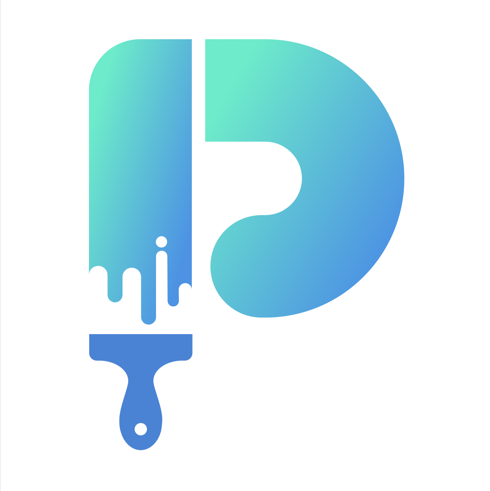

# DrawIT

<div id="top"></div>
<br />

<!-- PROJECT LOGO -->
<br />
<div align="center">
  <a href="#"><!-- lien repo-->
    
  </a>

  <h3 align="center">DrawIT</h3>

  <p align="center">
    Cette application est un jeu fait en python qui permet de jouer en multi-joueur dont le but est de faire deviner à ses adversaires un mot en réalisant un dessin. Quant à eux, ils peuvent compliquer la tâche au dessinateur.
    <br />
    <br />
  </p>
</div>

<!-- TABLE OF CONTENTS -->
<details>
  <summary>Table of Contents</summary>
  <ol>
    <li>
      <a href="#about-the-project">About The Project</a>
      <ul>
        <li><a href="#built-with">Built With</a></li>
      </ul>
    </li>
    <li>
      <a href="#getting-started">Getting Started</a>
      <ul>
        <li><a href="#installation">Installation</a></li>
        <li><a href="#prerequisites">Prerequisites</a></li>
      </ul>
    </li>
    <li><a href="#usage">Usage</a></li>
    <li><a href="#license">License</a></li>
    <li><a href="#contact">Contact</a></li>
    <li><a href="#acknowledgments">Acknowledgments</a></li>
  </ol>
</details>

<!-- ABOUT THE PROJECT -->

## About The Project

![DrawIT Application][drawit_screenshot]

Explication du projet ...

I used `Python` and `Tkinter` for the graphical interface of this application.

<p align="right">(<a href="#top">back to top</a>)</p>

### Built With

This section should list any major frameworks/libraries used to bootstrap your project. Leave any add-ons/plugins for the acknowledgements section. Here are a few examples.

- [Python](https://www.python.org/)
- [Tkinter](https://docs.python.org/3/library/tk.html)

<p align="right">(<a href="#top">back to top</a>)</p>

<!-- GETTING STARTED -->

## Getting Started

To make the application work, please follow the steps below.

For my part i'm using bash commands

### Installation

_Below is an example of how you can instruct your audience on installing and setting up your app. This template doesn't rely on any external dependencies or services._

1. Clone the repo
   ```sh
   git clone https://gitlab-mmi.univ-reims.fr/haya0002/drawit.git DrawIT
   ```
2. enter in the following folder:

   ```sh
   cd DrawIT
   ```

3. Start the `server`
   ```python
   python3 DrawIT_App/Server.py
   ```
4. Launch as many `clients` as you want
   ```python
   python3 DrawIT_App/DrawIT.py
   ```

### Prerequisites

This is an example of how to list things you need to use the software and how to install them.

- Activate the virtual environment provided so that you don't have to install each missing module by yourself.

In the folder `DrawIT` where the env, README,... folder is located type :

```sh
source env/bin/activate
```

To deactivate type from any directory :

```sh
deactivate
```

<p align="right">(<a href="#top">back to top</a>)</p>

<!-- USAGE EXAMPLES -->

## Usage

To `Start the game` type into the chatbox :

```sh
//START
```

you can `Cheat` by typing :

```sh
//CHEAT
```

this will give you the word in the chatbox but beware, everyone will know that you cheated

<p align="right">(<a href="#top">back to top</a>)</p>

<!-- LICENSE -->

## License

HAYAT Rahim : `LICENSE.txt`

<p align="right">(<a href="#top">back to top</a>)</p>

<!-- CONTACT -->

## Contact

Project Link: [lien repo](lien repo)

<p align="right">(<a href="#top">back to top</a>)</p>

<!-- ACKNOWLEDGMENTS -->

## Acknowledgments

List of some resources that helped me to realize this project :

- [Apprentissage Python](https://www.udemy.com/course/formation-complete-python/)
- [Documentation Tkinter](https://docs.python.org/fr/3/library/tk.html)
- [Modélisation MVC](https://openclassrooms.com/fr/courses/6900866-write-maintainable-python-code/7009312-structure-an-application-with-the-mvc-design-pattern)
- [Socket TCP/UDP](https://youtu.be/3QiPPX-KeSc)

<p align="right">(<a href="#top">back to top</a>)</p>

<!-- MARKDOWN LINKS & IMAGES -->

[drawit_screenshot]: img/DrawIT_Game.png
